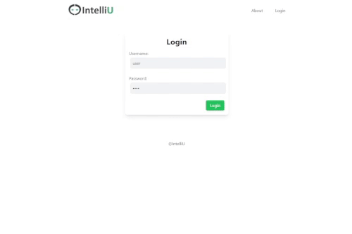

<!-- example readme :
https://github.com/cdraz/animal-connection-client-project/blob/master/README.md
 -->

# IntelliU Web Application

## Table of Contents

- [Description](#description)
- [Prerequisites](#prerequisites)
- [Installation](#installation)
- [Usage](#usage)
- [Built With](#built-with)

## Description

_Duration: 3 Week Sprint_

IntelliU Web Application is a project developed by the "JadeIntelliu" team over a three-week period. The application aims to address the challenges faced by engineers in the Medical Technology field when dealing with complex medical devices regulations and standards. The project focuses on creating a user-friendly interface to interact with IntelliU's proprietary system, providing functionalities such as file management, document analysis, and result retrieval.

## Gif



### Prerequisites

- You must have [Node.js](https://nodejs.org/en/) installed on your computer already

## Installation

1. Create a [Postgres](https://www.postgresql.org/download/) database named ``,
2. We recommend using Postico or PgAdmin to run the queries in `database.sql` as that was used to create the database. However, any database that accepts SQL language should do.

3. Create an env. file that looks like this:

```
#server Security
SERVER_SESSION_SECRET=*longpassword*

#intelliU neon DB
PGHOST='ep-word-word-123456-pooler.us-east-2.aws.neon.tech'
PGDATABASE='intelliu_group_project'
PGUSER='jadeintelliu'
PGPASSWORD='password'
ENDPOINT_ID='ep-word-word-123456-pooler'

#Sendgrid
SENDGRID_API_KEY='password'

#Cloudinary
REACT_APP_CLOUD_NAME=*password*
REACT_APP_API_KEY=*numeric code*
REACT_APP_API_SECRET=*secret password*
```

4. Open up your editor of choice and run an `npm install`
5. Run `npm run server` in your terminal
6. Run `npm run client` in your terminal

## Usage

How does someone use this application?:

Admins can:

1. Log in with their username and password
2. Add, delete, and view standards currently in the system.
3. Create new user accounts for clients and admins.

Users can:

1. Log in with your account ID and password.
2. Select an uploaded standard document and upload a documentation for analysis.
3. View results from comparing documents on the dashboard.
   (Currently the project is set to view example data to respect the privacy of IntelliU and their clients.)

## Next Steps of Development

1. Connect to the IntelliU backend api to receive the documents being compared. (A file has been started named document.intelliu.router.js in the modules folder)
2. The download button needs to be completed.
3. Emails to new users has been started but not completed

## Built With

<a href="https://react.dev/"></a>
<a href="https://redux-saga.js.org/"></a>
<a href="https://nodejs.org/en"></a>
<a href="https://www.npmjs.com/package/express"></a>
<a href="https://axios-http.com/"></a>
<a>

</a>
<a href="https://eggerapps.at/postico/v1.php"></a>
<a href="https://tailwindcss.com/"></a>
<a href="https://www.passportjs.org/"></a>
<a href="https://sendgrid.com/en-us"></a>
<a href="https://www.npmjs.com/package/nodemon"></a>

## Acknowledgement

Thanks to [Prime Digital Academy](www.primeacademy.io) who equipped and helped me to make this application a reality.
